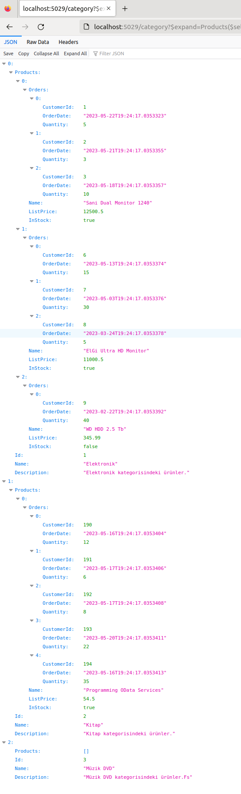

# OData Challenge

OData servislerinde birden fazla resource kullanımını amaçlayan örnek uygulama. Senaryoda Kategoriler, Ürünler ve Siparişlerin tutulduğu ilkel bir senaryo söz konusu. Bu senaryoda amaç aşağıdaki gibi bir sorgunun OData hizmeti olarak REST tabanlı bir servis üzerinden sunulabileceğini göstermektir.

- Kategoriler altındaki ürünler ve bu ürünler için verilen siparişlerin listelenmesinin sağlanması. Yani şuna bir benzer querystring yollamak istiyoruz -> *category?$expand=Products($select=Name,ListPrice,InStock;$expand=Orders($select=CustomerID,OrderDate,Quantity))*

## Ön Hazırlıklar

Bu örnekte SQL Server veritabanı kullanılmakta. Onu bir docker imaj olarak kullanabiliriz. Diğer yandan kod tarafından veritabanı nesnelerinin oluşturulması (migration) için de Entity Framework komut satırı aracından yararlanılmakta. Gerekli hazırlıkları aşağıdaki gibi yapabiliriz.

```bash
# SQL docker örneğini başlatmak için (Şifreyi siz istediğiniz gibi verebilir veya aynısını kullanabilirsiniz)
sudo docker run -e "ACCEPT_EULA=Y" -e "SA_PASSWORD=tig@r76!" -p 1434:1433 --name sql-south --hostname sql-south -d mcr.microsoft.com/mssql/server:2022-latest

# Migration için EF tool'a ihtiyacımız olacaktır
dotnet tool install -g dotnet-ef

# Bu komutları MusicLibrary.Data klasörü içerisindeyken çalıştırabiliriz.
dotnet ef migrations add Initial --startup-project ../SouthWind.Service
dotnet ef database update --startup-project ..//SouthWind.Service
```

## Çalışma Zamanı

Öncelikle SQL docker container'ının çalışır olduğundan emin olmak lazım. Sonrasında en azından veri çekebilmek için Migration planlarının işletildiğinden. Bu işlemlerde bir sıkıntı yoksa SouthWind.Service isimli .Net uygulamasının çalıştırılması yeterlidir.

```bash
dotnet run
```



Bu sorgunun çalışması sırasında EF tarafında da aşağıdaki SQL sorgusu çalıştırılacaktır.

```sql
SELECT [c].[Id], [c].[Description], [c].[Name], [t].[Id], [t].[CustomerId], [t].[OrderDate], [t].[Quantity], [t].[Id0], [t].[Name], [t].[ListPrice], [t].[InStock]
      FROM [Categories] AS [c]
      LEFT JOIN (
          SELECT [p].[Id], [o].[CustomerId], [o].[OrderDate], [o].[Quantity], [o].[Id] AS [Id0], [p].[Name], [p].[ListPrice], [p].[InStock], [p].[CategoryId]
          FROM [Products] AS [p]
          LEFT JOIN [Orders] AS [o] ON [p].[Id] = [o].[ProductId]
      ) AS [t] ON [c].[Id] = [t].[CategoryId]
      ORDER BY [c].[Id], [t].[Id]
```